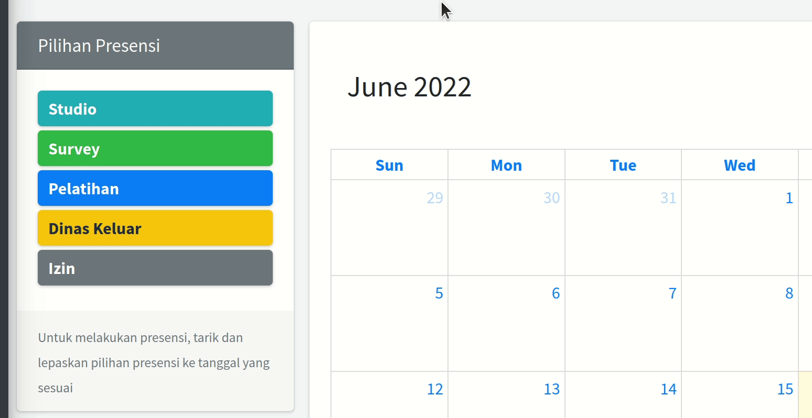

Presensi
========

Melakukan Presensi
------------------
Anda dapat melakukan presensi pada halaman presensi di `halaman presensi`_. Anda juga dapat mengakses halaman presensi melalui menu samping Presensi, atau melalui halaman dashboard pada tombol ``Presensi``.

Langkah untuk melakukan presensi, adalah:

#. Pilih opsi presensi pada bagian Pilihan Presensi di sebelah kiri atas
#. *Drag and drop* opsi presensi ke tanggal yang sesuai.
#. Setelah itu akan muncul jendela untuk menuliskan keterangan. Tuliskan keterangan pada kolom yang ada, kemudian klik ``Ok``.
#. Jika berhasil, akan tertulis presensi yang dipilih pada kotak tanggal yang sesuai.

Membatalkan Presensi
--------------------
1. Buka halaman presensi
2. Pada kalender, cari tanggal yang akan dibatalkan presensinya
3. Klik pada kotak presensi yang ingin dihapus.
4. Akan muncul jendela untuk mengonfirmasi pembatalan presensi, klik ``Hapus``.

Melihat Keterangan Presensi
---------------------------
Anda dapat melihat keterangan pada presensi Anda di tanggal tertentu dengan cara mengarahkan pointer mouse ke kotak presensi yang dimaksud. Akan muncul bubble yang berisi keterangan presensi di tanggal tersebut.

Melihat Grafik Presensi Bulanan
-------------------------------
Anda dapat melihat ringkasan presensi yang Anda lakukan selama satu bulan dalam bentuk pie chart. Anda dapat mengaksesnya di halaman profil akun Anda melalui menu samping yang tertulis nama Akun Anda. *Pie chart* akan muncul di sebelah kanan atas.
Pada bagian yang sama, terdapat kolom bulan dan tahun yang dapat Anda pilih untuk menampilkan grafik pada bulan dan tahun tertentu.
Apabila tidak ada data presensi pada bulan yang dipilih, maka akan muncul pesan pemberitahuan belum presensi pada bulan yang dipilih.

.. _halaman presensi: https://sigas.geoartscience.co.id/user/presensi

.. autosummary::
   :toctree: generated

   lumache